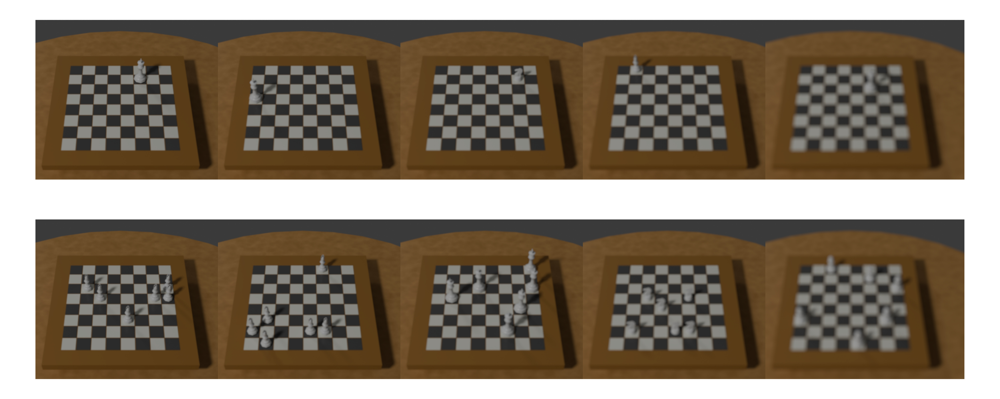
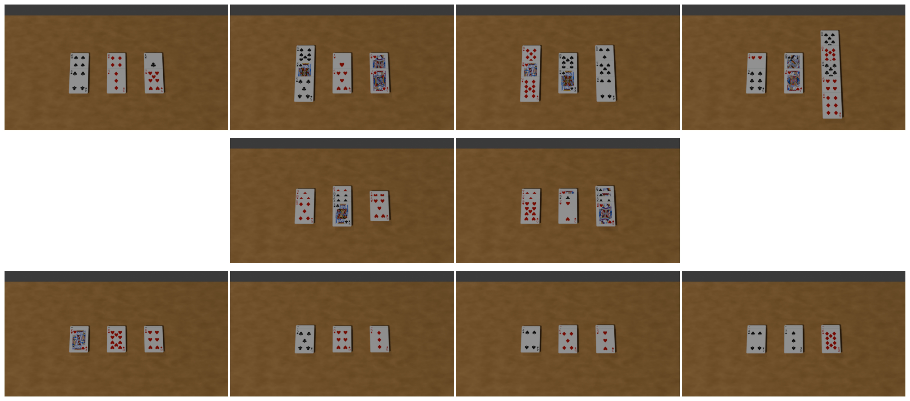
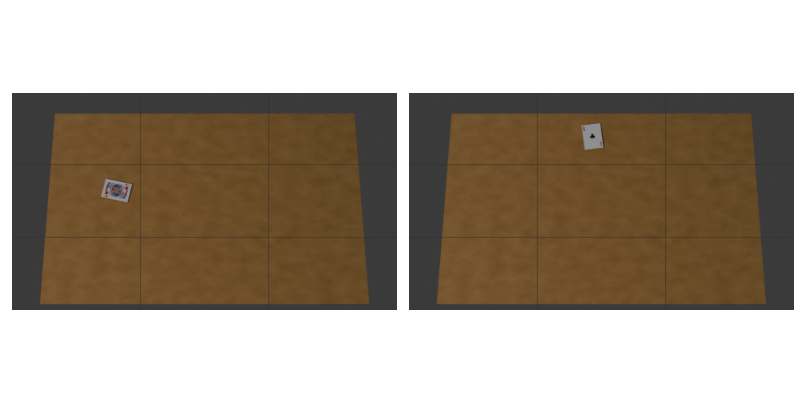
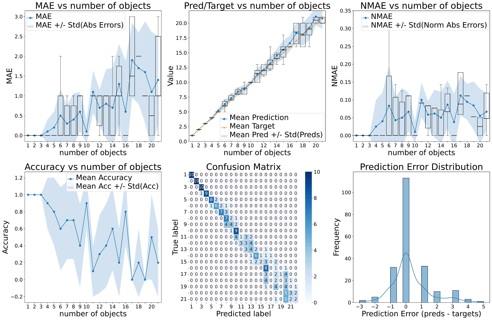
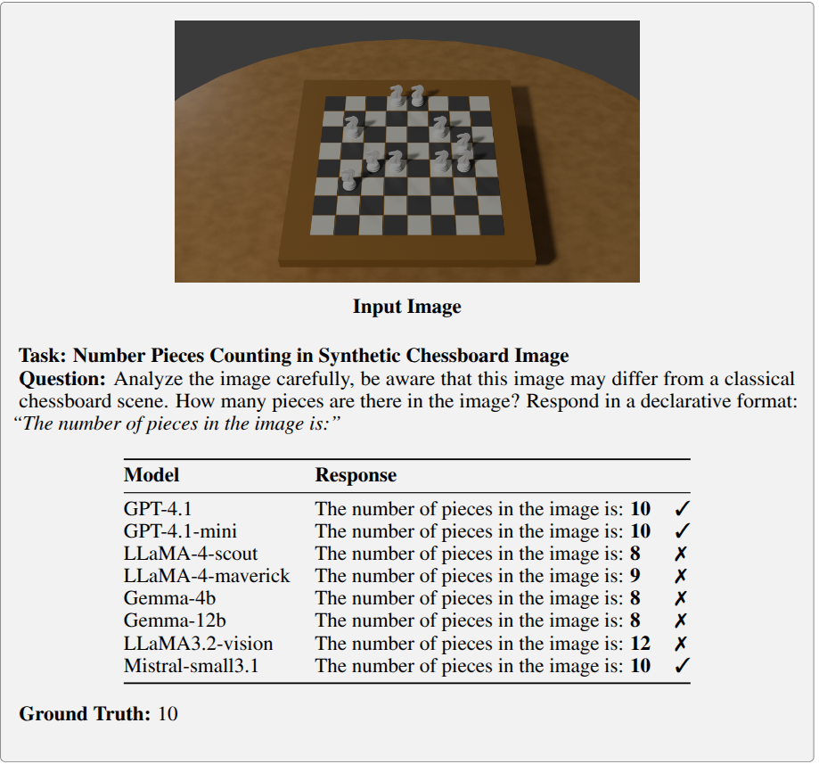

---

# BYO-Eval: Empower Your Vision-Language Models with Custom Datasets!

Create your own image datasets with Blender to unlock a deeper understanding of your Vision-Language Model (VLM)’s perception abilities. Perfect for diagnostic evaluations and performance analysis, BYO-Eval allows you to tailor datasets specifically for testing VLMs in visual reasoning tasks.


## Why BYO-Eval?

Building and testing VLMs can be complex, but assessing their capabilities doesn't have to be. With BYO-Eval, you can:

* **Create custom datasets** using Blender’s procedural generation to test your model's limits.
* **Evaluate three key skills** in VLMs: Counting, Identification, and Localization of objects.
* **Understand your model's strengths and weaknesses** with precise, fine-grained diagnostic metrics.

### Key Features:

* **Custom Image Generation**: Build datasets with Blender tailored to specific tasks like Chess and Poker.
* **Support for Multiple VLM Providers**: Test models across multiple platforms (Azure OpenAI, Groq, Ollama, Huggingface).
* **Comprehensive Metrics**: Measure accuracy, F1, precision, recall, MAE, MSE, RMSE, NMAE, and more.
* **Interactive UI**: A user-friendly terminal interface that keeps track of your progress.
* **Dynamic Question Generation**: Let the system adapt questions based on what’s in the image.
* **Reliable Fallback Mechanisms**: Ensure robust evaluations even in the most challenging test conditions.

## Quick Start

### Prerequisites

* Python 3.10+
* Dependencies listed in `requirements.txt`
* API keys for your selected VLM providers

### Setup

#### Conda Environment

```bash
conda create -n venv python=3.10
conda activate venv
```

#### Virtual Environment

```bash
python -m venv venv
source venv/bin/activate
```

#### Install Dependencies

```bash
pip install -r requirements.txt
```

Don't forget to add your **.env** file with the necessary API credentials.

## Running the Evaluation

Start testing your model with:

```bash
python evaluate_diagnose_dataset.py
```

Want to run it with Docker? Check out `DOCKER_README.md` for setup instructions.

## Visual Examples

### Chess: Varying Levels of Blur

Check out how changing blur affects the dataset:



### Poker: Vertical Card Overlap

Observe how different overlap levels influence model performance:



### Poker: Localization on a 3x3 Grid

Evaluate how well your model locates cards on a grid:



## Evaluation Results: Insights

### GPT-4.1 Diagnostic on Counting Task

Here’s a sneak peek at how GPT-4.1 performs on counting objects:



### Model Comparison on a Single Image

How does your model stack up? Compare results on one image:



### Model Performance on the Chess Counting Dataset

Here’s how different models perform over a range of chess images (piece count ranges from $1$ to $21$).

| **Model**          | **Acc↑** | **F1↑** | **Prec↑** | **Rec↑** | **MAE↓** | **MSE↓** | **NMAE↓** | **Rel↑** | **Cons↑** |
|--------------------|----------|---------|-----------|----------|----------|----------|-----------|----------|-----------|
| gpt-4.1            | 0.743    | 0.853   | 0.793     | 0.922    | 0.319    | 0.476    | 0.160     | 0.743    | 0.262     |
| gpt-4.1-mini       | **0.806**| **0.893**| **0.828** | **0.969**| **0.209**| **0.251**| **0.084** | **0.806**| 0.277     |
| LLaMA-4-scout      | 0.639    | 0.780   | 0.678     | 0.917    | 0.466    | 0.707    | 0.202     | 0.639    | 0.267     |
| LLaMA-4-maverick   | 0.445    | 0.616   | 0.494     | 0.817    | 0.670    | 0.921    | 0.318     | 0.445    | 0.330     |
| gemma3:4b          | 0.476    | 0.645   | 0.503     | 0.901    | 0.838    | 1.906    | 0.317     | 0.476    | 0.419     |
| gemma3:12b         | 0.495    | 0.645   | 0.543     | 0.916    | 0.862    | 1.893    | 0.320     | 0.487    | 0.459     |
| LLaMA3.2-vision    | 0.400    | 0.571   | 0.455     | 0.857    | 0.932    | 2.356    | 0.590     | 0.403    | 0.343     |
| mistral-small3.1   | 0.520    | 0.684   | 0.520     | 0.923    | 0.880    | 1.802    | 0.224     | 0.536    | **0.557** |
## Citation

If you found this useful, please cite our work:

```bibtex
@article{byo_eval,
  title={BYO_Eval: Build Your Own Dataset for Fine-Grained Visual Assessment of Multimodal Language Models},
  author={Ludovic Arnould, Salim Khazem, Hugues Ali Mehenni},
  year={2025}
}
```

For the full paper, [click here](assets/BYO_Eval__Build_Your_Own_Dataset_for_Fine_Grained_Visual_Assessment_of_Multimodal_Language_Models.pdf).

---

